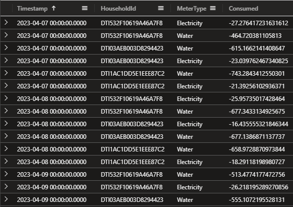

## Case 1

**To bill or not to bill?**


> Dear Detective,

> Welcome to the Kusto Detective Agency! We're thrilled to have you on board for an exciting new challenge that awaits us. Get ready to put your detective skills to the test as we dive into a perplexing mystery that has struck Digitown.

> Imagine this: It's a fresh new year, and citizens of Digitown are in an uproar. Their water and electricity bills have inexplicably doubled, despite no changes in their consumption. To make matters worse, the upcoming mayoral election amplifies the urgency to resolve this issue promptly.

> But fear not, for our esteemed detective agency is on the case, and your expertise is vital to crack this mystery wide open. We need your keen eye and meticulous approach to inspect the telemetry data responsible for billing, unravel any hidden errors, and set things right.

> Last year, we successfully served Mayor Gaia Budskott, leaving a lasting impression. Impressed by our work, the city has once again turned to us for assistance, and we cannot afford to disappoint our client.

> The city's billing system utilizes SQL (an interesting choice, to say the least), but fret not, for we have the exported April billing data at your disposal. Additionally, we've secured the SQL query used to calculate the overall tax. Your mission is to work your magic with this data and query, bringing us closer to the truth behind this puzzling situation.

> Detective, we have complete faith in your abilities, and we are confident that you will rise to the occasion. Your commitment and sharp instincts will be instrumental in solving this enigma.

Answer the question - What is the total bills amount due in April?

The Kusto Detective Agency welcomes you to investigate a mystery in Digitown where water and electricity bills have doubled without explanation. Equipped with telemetry data and an SQL query, you must use your skills to uncover hidden errors and solve the perplexing situation before the upcoming mayoral election.

Ingest the below data into your free cluster:

```kusto
.execute database script <|
// The script takes ~20seconds to complete ingesting all the data.
.set-or-replace Costs <| 
    datatable(MeterType:string, Unit:string, Cost:double) [
     'Water', 'Liter', 0.001562, 
     'Electricity', 'kwH', 0.3016]
.create-merge table Consumption (Timestamp:datetime , HouseholdId:string, MeterType:string, Consumed:double)
.ingest async into table Consumption (@'https://kustodetectiveagency.blob.core.windows.net/kda2c1taxbills/log_00000.csv.gz')
.ingest async into table Consumption (@'https://kustodetectiveagency.blob.core.windows.net/kda2c1taxbills/log_00001.csv.gz')
.ingest into table Consumption (@'https://kustodetectiveagency.blob.core.windows.net/kda2c1taxbills/log_00002.csv.gz')
```

Here's the SQL query used for the calculation.

```sql
SELECT SUM(Consumed * Cost) AS TotalCost
FROM Costs
JOIN Consumption ON Costs.MeterType = Consumption.MeterType
```

Let's see what we have in the Consumption table.

```kusto
Consumption
| take 10
```


We have the columns Timestamp:datetime , HouseholdId:string, MeterType:string, and Consumed:double.

Let's see if we can find some more information about the data.

```kusto
Consumption
| summarize count() by MeterType
```


So we have two different MeterTypes, Water and Electricity. Let's see what we have in the 'Costs' table.

```kusto
Costs
```


Ok, so we have the columns MeterType:string, Unit:string, and Cost:double.

The riddle stated that the costs have doubled, so let's see if we can find some more information about that.

```kusto
Consumption
| summarize Count=count() by Timestamp, HouseholdId, MeterType, Consumed
| where Count > 1
| sort by HouseholdId
```


So we have some duplicate readings, let's see some data in a linechart per day.

```kusto
Consumption
| summarize sum(Consumed) by bin(Timestamp, 1d)
| render linechart 
```


Grabbing one of the HouseholdId and take a look at the duplicate readings.

```kusto
Consumption
| where HouseholdId == "DTI0002D0C64A9746E3"
| sort by Timestamp asc
```


So we do have some duplicate readings, but we also have some readings that are not duplicate. We need to find a way to only calculate one reading per day and per MeterType. Let's try with some basic query.

```kusto
Consumption 
| summarize Readings = count() by HouseholdId, MeterType
| where Readings > 30
| sort by HouseholdId
```


Ok, so we have some HouseholdId that have more than 30 readings per 'MeterType', we only want one reading per day per 'MeterType'.

I think we need to check the Consumed column and see if we have some negative values.

```kusto
Consumption
| where Consumed < 0
```

Yes, we have 144 records with that! So we need to have that in mind for our final solution.



We have some options to remove duplicate readings, we can use the arg_max() function or distinct operator. Here we will only look at the Electricity MeterType.

**arg_max()**

```kusto
Consumption
| where Consumed > 0
| where MeterType == 'Electricity'
| summarize arg_max(Timestamp,*) by Consumed
| summarize sum(Consumed)
```

**distinct**

```kusto
Consumption
| where MeterType == 'Electricity'
| where Consumed > 0
| distinct *
| summarize sum(Consumed)
```

Same result, but I will use the arg_max() function in my solution. You remember that we had another table called 'Costs' with the cost for each MeterType? Let's join that table with the Consumption table with 'lookup' operator.

```kusto
Consumption
| where Consumed > 0
| summarize arg_max(Timestamp,*) by Consumed
| summarize sum(Consumed) by MeterType
| lookup Costs on MeterType
```


Now let's add the calculation for the total cost. Remember the names of the columns in the Costs table? We can use the same name for the columns in the Consumption table when we have the lookup operator. (We will make the name of the summarize more precise in the final solution, for now it will get the name of 'sum_Consumed'.)

```kusto
Consumption
| where Consumed > 0
| summarize arg_max(Timestamp,*) by Consumed
| summarize sum(Consumed) by MeterType
| lookup Costs on MeterType
| extend TotalCostPerMeterType = sum_Consumed * Cost
```


Grab your calculator and calculate the sum of the TotalCostPerMeterType column... just kidding, we can use the summarize sum() function to get the final result.

```kusto
Consumption
| where Consumed > 0
| summarize arg_max(Timestamp,*) by Consumed
| summarize sum(Consumed) by MeterType
| lookup Costs on MeterType
| extend TotalCostPerMeterType = sum_Consumed * Cost
| summarize sum(TotalCostPerMeterType)
```

To make it more readable we can rename our columns, see below:

```kusto
Consumption
| where Consumed > 0
| summarize arg_max(Timestamp,*) by Consumed
| summarize SumOfConsumed = sum(Consumed) by MeterType
| lookup Costs on MeterType
| extend TotalCostPerMeterType = SumOfConsumed * Cost
| summarize TotalBillforApril = sum(TotalCostPerMeterType)
```

Ok for a final solution but we can do better. The query above will take some time to run (11 seconds), let's see if we can optimize it.

```kusto
Consumption
| where Consumed > 0
| distinct *
| summarize SumOfConsumed = sum(Consumed) by MeterType
| lookup Costs on MeterType
| extend TotalCostPerMeterType = SumOfConsumed * Cost
| summarize TotalBillforApril = sum(TotalCostPerMeterType)
```

We are down to 4.5 seconds and we have the same result. This can be better with the shuffle query operator if we want to. Let's try that.

```kusto
Consumption
| summarize hint.strategy=shuffle arg_max(Consumed, *) by HouseholdId, MeterType, Timestamp
| lookup Costs on MeterType
| summarize sum(Consumed * Cost)
```

Down to 2 seconds now. Great! Get more familiar with the shuffle query operator here: [shuffle query](https://learn.microsoft.com/azure/data-explorer/kusto/query/shufflequery?WT.mc_id=AZ-MVP-5004683).
