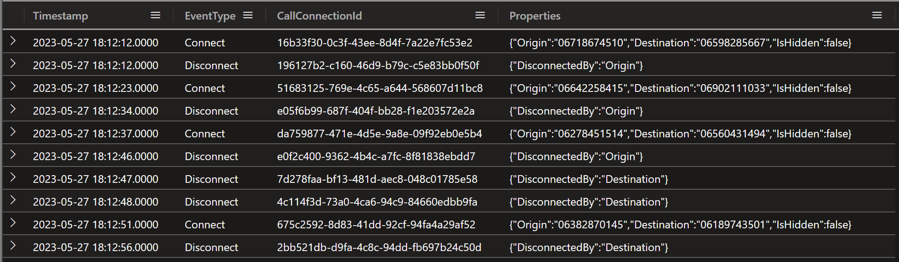
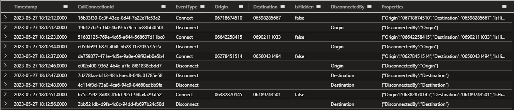
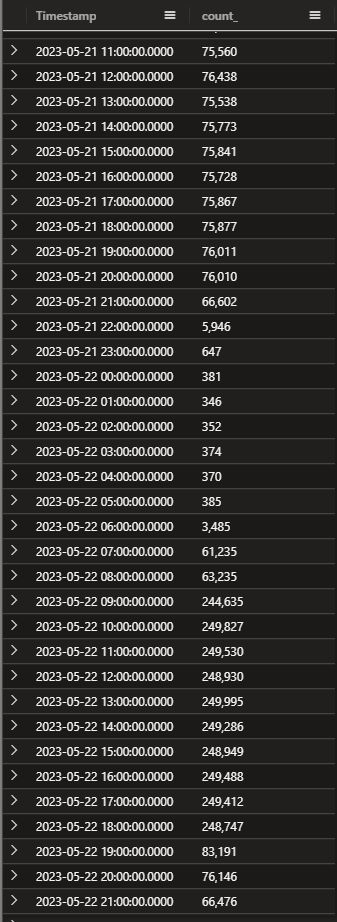
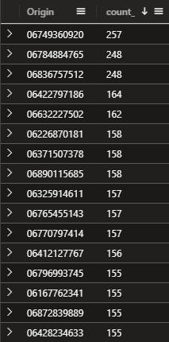
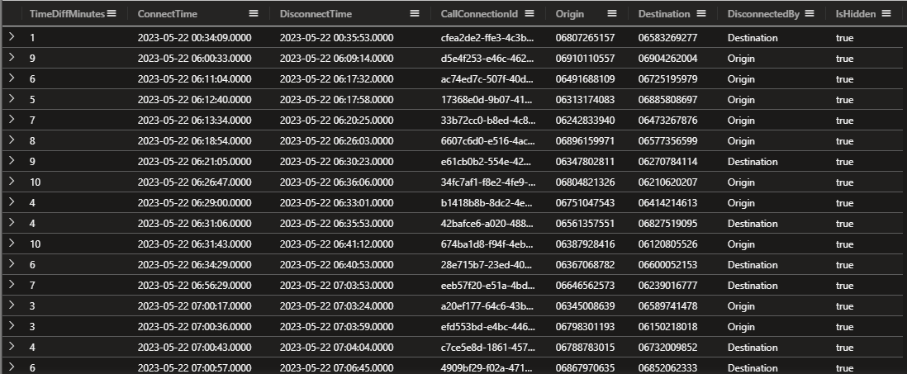

## Case 2

**Catch the Phishermen**


> Hey Detective,

> We've got another case that needs your expertise! The people of our city are being targeted by phishermen, and they need your help to stop them in their tracks.

> The complaints are pouring in, and people are fed up with the sudden increase in phishing calls attempting to steal their identity details. We can't let these scammers get away with it, and we need your help to catch them!

> The police have asked for our assistance, and we've got a massive data set to work with. We've got listings of all the calls that have been made during the week, and we need to find the source of the phishing calls.

> It's not going to be easy, but we know you're up for the challenge! We need you to analyze the data and use your detective skills to find any patterns or clues that could lead us to the source of these calls.

> Once we have that information, the police can take action and put a stop to these scammers once and for all! Are you ready to take on this challenge, detective?

> We've got your back, and we know you can do this! Let's catch those phishermen!

Let's jump into the data! Copy and run the following to create the PhoneCalls table. Warning, it took me almost 1,5 minute to ingest the data so be patient.

```kusto
.execute database script <|
.create-merge table PhoneCalls (Timestamp:datetime, EventType:string, CallConnectionId:string, Properties:dynamic)
.ingest async into table PhoneCalls (@'https://kustodetectiveagency.blob.core.windows.net/kda2c2phonecalls/log_00000.csv.gz')
.ingest async into table PhoneCalls (@'https://kustodetectiveagency.blob.core.windows.net/kda2c2phonecalls/log_00001.csv.gz')
// Last command is running sync, so when it finishes the data is already ingested.
// It can take about 1min to run.
.ingest into table PhoneCalls (@'https://kustodetectiveagency.blob.core.windows.net/kda2c2phonecalls/log_00002.csv.gz')
```

Let's see what we have.

```kusto
PhoneCalls
| take 10
```



As you see we once again have the dynamic Properties column. We can with ease extract the values with dot notation - tostring(Properties.Origin).

Let's make the output easier to read and use 'project-reorder' to order the columns the way we want.

```kusto
PhoneCalls
| take 10
| extend Origin = tostring(Properties.Origin)
| extend Destination = tostring(Properties.Destination)
| extend IsHidden = tobool(Properties.IsHidden)
| extend DisconnectedBy = tostring(Properties.DisconnectedBy)
| project-reorder Timestamp,CallConnectionId,EventType,Origin,Destination,IsHidden,DisconnectedBy
```



So we can assume that somewhere under the Origin column (that we created with the extend function) is our phishermen. And could the calls be under the 'IsHidden' property as well? 

I'm interested in when the phishermen starts working on the calls. Let's see if we can find some more information with summarize and the bin() function against the Timestamp column.

```kusto
PhoneCalls
| summarize count() by bin(Timestamp,1h)
```



Hmm, at least I find that there are some significant increase but doesn't mean anything yet. Could be legit calls as well, it all depends on how many calls the phishermen have made.

But having this in mind, let's see if we can use that information to see if what will help us locating the phishermen.

Let's start by looking into the 'EventType' of 'Connect' and where the caller (Origin) hides their number with 'IsHidden'.

```kusto
PhoneCalls
| extend Origin = tostring(Properties.Origin)
| extend Destination = tostring(Properties.Destination)
| extend IsHidden = tobool(Properties.IsHidden)
| extend DisconnectedBy = tostring(Properties.DisconnectedBy)
| where EventType == "Connect"
| where IsHidden == true
| summarize count() by Origin
```



Here's our first suspects for this crime, because I do belive that the phishermen have been making a larger number of calls. Let's see if we can find some more information.

Let's add some calculation to the 'Connect' and 'Disconnect' events. We can use the datetime_diff() function to calculate the time between the events.

I have renamed the columns for the time to ConnectTime and DisconnectTime (Timestamp1 refers to the Timestamp inside of the join, and are therefore the DisconnectTime).

Where hourofday() function is great so we can only search for the time between 9 and 18.

Also added a new column called TimeDiffMinutes to see how long the calls are and I have added a filter to only show calls that are between 0 and 10 minutes long.

Let's focus on one days events, as you see in the query below I have added a filter for the 22nd of May 2023.

```kusto
PhoneCalls
| where Timestamp between (datetime(2023-05-22 00:00:00) .. datetime(2023-05-22 23:59:59))
| extend Origin = tostring(Properties.Origin)
| extend Destination = tostring(Properties.Destination)
| extend IsHidden = tobool(Properties.IsHidden)
| where EventType == "Connect"
| where IsHidden == true
| join kind=inner 
    (
        PhoneCalls
        | where EventType == "Disconnect"
        | extend DisconnectedBy = tostring(Properties.DisconnectedBy)
    ) 
        on CallConnectionId
| project ConnectTime=Timestamp,DisconnectTime=Timestamp1,CallConnectionId,Origin,Destination,DisconnectedBy,IsHidden
| extend TimeDiffMinutes = datetime_diff('minute',DisconnectTime,ConnectTime)
| where TimeDiffMinutes between (0 .. 10)
| where hourofday(ConnectTime) >= 9
| where hourofday(ConnectTime) < 18
| project-reorder TimeDiffMinutes,*
```



So we have a lot of calls that are between 0 and 10 minutes long. Let's see if we can find some more information about the calls if we add the dcount() function.

! Note that we need to remove the first where clause (where Timestamp between (datetime(2023-05-22 00:00:00) .. datetime(2023-05-22 23:59:59))) to get the correct result.

Added CountOfCalls with dcount(Destination) to see if we can identity who have been making the most calls (and of course we need to sort the output and grab top 10).

```kusto
PhoneCalls
| extend Origin = tostring(Properties.Origin)
| extend Destination = tostring(Properties.Destination)
| extend IsHidden = tobool(Properties.IsHidden)
| where EventType == "Connect"
| where IsHidden == true
| join kind=inner 
    (
        PhoneCalls
        | where EventType == "Disconnect"
        | extend DisconnectedBy = tostring(Properties.DisconnectedBy)
    ) 
        on CallConnectionId
| project ConnectTime=Timestamp,DisconnectTime=Timestamp1,CallConnectionId,Origin,Destination,DisconnectedBy,IsHidden
| extend TimeDiffMinutes = datetime_diff('minute',DisconnectTime,ConnectTime)
| where TimeDiffMinutes between (0 .. 10)
| where hourofday(ConnectTime) >= 9
| where hourofday(ConnectTime) < 18
| project-reorder TimeDiffMinutes,*
| summarize CountOfCalls = dcount(Destination) by Origin
| sort by CountOfCalls desc 
| top 10 by CountOfCalls
```

Have we found our phishermen? 🎣
