# Kusto Detective Agency Hints - Season 2

This repo contains some additional hints to the existing ones in the game of Kusto Detective Agency 🕵️ 🔐 (Under construction!)


In this season of Kusto Detective Agency (KDA) there will be 10 new challenges.


* [Onboarding Case](#Onboarding)
* [Case 1](#Case-1)
* [Case 2](#Case-2)
* [Case 3 (Coming Soon)](#Case-3)
* [Case 4 (Coming Soon)](#Case-4)
* [Case 5 (Coming Soon)](#Case-5)
* [Case 6 (Coming Soon)](#Case-6)
* [Case 7 (Coming Soon)](#Case-7)
* [Case 8 (Coming Soon)](#Case-8)
* [Case 9 (Coming Soon)](#Case-9)
* [Case 10 (Coming Soon)](#Case-10)

## Information

We can switch between the seasons if we want to. See the green icon for season 1 and the yellow icon for season 2.

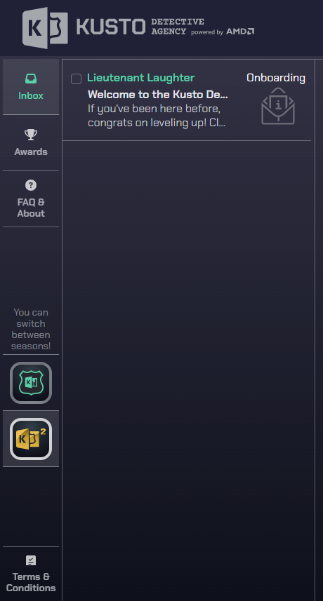

Like season 1 we will have a onboarding process and guess what, we all are rookies once again.

> If you have been here for Season 1, you may be surprised to find yourself as a Rookie again. You see, it's all about innovation and hitting refresh. So, it's a fresh start for everyone. Yet we believe in excellence and that's why we need your detective skills to unveil the crème de la crème of detectives from the past year, 2022. This is like the ultimate leaderboard challenge where we crown the "Most Epic Detective of the Year." Exciting, right?

> Imagine our agency as a buzzing beehive, like StackOverflow on steroids. We have a crazy number of cases popping up every day, each with a juicy bounty attached (yes, cold, hard cash!). And guess what? We've got thousands of Kusto Detectives scattered across the globe, all itching to pick a case and earn their detective stripes. But here's the catch: only the first detective to crack the case gets the bounty and major street cred!

> So, your mission, should you choose to accept it, is to dig into the vast archives of our system operation logs from the legendary year 2022. You're on a quest to unearth the absolute legend, the detective with the biggest impact on our business—the one who raked in the most moolah by claiming bounties like a boss!

> Feeling a bit rusty or want to level up your Kusto skills? No worries, my friend. We've got your back with the "Train Me" section. It's like a power-up that'll help you sharpen your Kusto-fu to tackle each case head-on. Oh, and if you stumble upon a mind-boggling case and need a little nudge, the "Hints" are there to save the day!

> Now, strap on your detective hat, embrace the thrill, and get ready to rock this investigation. The fate of the "Most Epic Detective of the Year" rests in your hands!

> Good luck, rookie, and remember to bring your sense of humor along for this wild ride!

> Lieutenant Laughter

So now we need to find the detective who earned the most money.

## Onboarding

**Welcome to season 2!**

Answer the question: Who is the detective that earned most money in 2022?

Start by logging in to your free ADX cluster, if you need to start over and create a new cluster - follow the guide here https://aka.ms/kustofree. Make sure to copy the Cluster URI (ending with kusto.windows.net) and save that somewhere or access https://dataexplorer.azure.com/freecluster to see it.

Insert the below data into your ADX cluter:

```kusto
.execute database script <|
// Create a table for the telemetry data:
.create table DetectiveCases(Timestamp:datetime, EventType:string, DetectiveId:string, CaseId: string, Properties:dynamic)
// Load the data:
.ingest async into table DetectiveCases (@'https://kustodetectiveagency.blob.core.windows.net/kda2start/log_00000.csv.gz')
.ingest async into table DetectiveCases (@'https://kustodetectiveagency.blob.core.windows.net/kda2start/log_00001.csv.gz')
.ingest into table DetectiveCases (@'https://kustodetectiveagency.blob.core.windows.net/kda2start/log_00002.csv.gz')
```

Now we have the table **DetectiveCases** with the columns Timestamp:datetime, EventType:string, DetectiveId:string, CaseId: string, and Properties:dynamic.

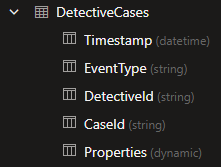

```kusto
DetectiveCases
| take 10
```

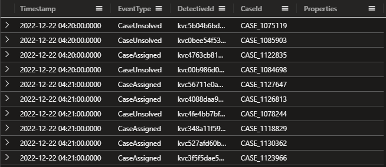

In my case I didn't see any data in the Properties column. Let's dig into that.

```kusto
DetectiveCases
| where isnotempty(Properties)
| take 10
```

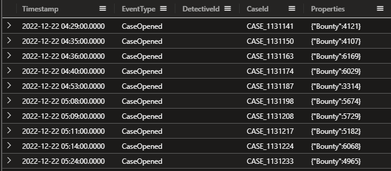

Oh now we see 'Bounty' and a value. And all cases have the event 'CaseOpened'. Let's see how many EventTypes we have.

```kusto
DetectiveCases
| summarize count() by EventType
```

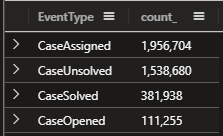

Let's try to extract the Bounty value from the Properties column with:

```kusto
DetectiveCases
| extend Bounty = toreal(Properties.Bounty)
| where isnotempty( Bounty )
| project Timestamp, EventType, DetectiveId, CaseId, Bounty
```

Now that we have extracted that value we can add a new line with summarize sum() to get the total bounty.

```kusto
DetectiveCases
| extend Bounty = toreal(Properties.Bounty)
| where isnotempty(Bounty)
| project Timestamp, EventType, DetectiveId, CaseId, Bounty
| summarize TotalBounty = sum(Bounty)
```

If we go deeper into a case and how that case will be assigned to different detectives, we do see that multiple detectives can solve one case.

```kusto
DetectiveCases
| where CaseId == "CASE_1116553"
```

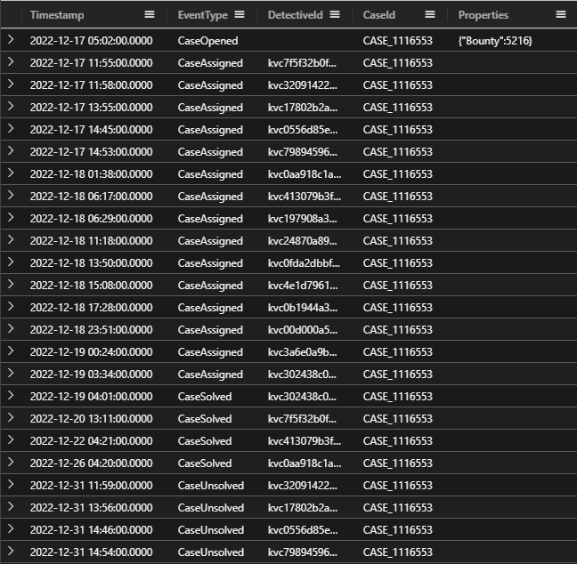

I do believe we need to join this with "CaseSolved" event and take the first detected that solved that case and the arg_min() function with the Timestamp column will help us with that.

**My solution:**

```kusto
DetectiveCases
| extend Bounty = toreal(Properties.Bounty)
| project CaseId, DetectiveId, Bounty
| join kind=inner (
DetectiveCases
| where EventType == "CaseSolved"
| summarize arg_min(Timestamp, DetectiveId) by CaseId
| project-rename FirstDetective=DetectiveId
) on CaseId
| summarize TotalBountyToDetective=sum(Bounty) by FirstDetective
| top 1 by TotalBountyToDetective desc
```


## Case 1

**To bill or not to bill?**


> Dear Detective,

> Welcome to the Kusto Detective Agency! We're thrilled to have you on board for an exciting new challenge that awaits us. Get ready to put your detective skills to the test as we dive into a perplexing mystery that has struck Digitown.

> Imagine this: It's a fresh new year, and citizens of Digitown are in an uproar. Their water and electricity bills have inexplicably doubled, despite no changes in their consumption. To make matters worse, the upcoming mayoral election amplifies the urgency to resolve this issue promptly.

> But fear not, for our esteemed detective agency is on the case, and your expertise is vital to crack this mystery wide open. We need your keen eye and meticulous approach to inspect the telemetry data responsible for billing, unravel any hidden errors, and set things right.

> Last year, we successfully served Mayor Gaia Budskott, leaving a lasting impression. Impressed by our work, the city has once again turned to us for assistance, and we cannot afford to disappoint our client.

> The city's billing system utilizes SQL (an interesting choice, to say the least), but fret not, for we have the exported April billing data at your disposal. Additionally, we've secured the SQL query used to calculate the overall tax. Your mission is to work your magic with this data and query, bringing us closer to the truth behind this puzzling situation.

> Detective, we have complete faith in your abilities, and we are confident that you will rise to the occasion. Your commitment and sharp instincts will be instrumental in solving this enigma.

Answer the question - What is the total bills amount due in April?

The Kusto Detective Agency welcomes you to investigate a mystery in Digitown where water and electricity bills have doubled without explanation. Equipped with telemetry data and an SQL query, you must use your skills to uncover hidden errors and solve the perplexing situation before the upcoming mayoral election.

Ingest the below data into your free cluster:

```kusto
.execute database script <|
// The script takes ~20seconds to complete ingesting all the data.
.set-or-replace Costs <| 
    datatable(MeterType:string, Unit:string, Cost:double) [
     'Water', 'Liter', 0.001562, 
     'Electricity', 'kwH', 0.3016]
.create-merge table Consumption (Timestamp:datetime , HouseholdId:string, MeterType:string, Consumed:double)
.ingest async into table Consumption (@'https://kustodetectiveagency.blob.core.windows.net/kda2c1taxbills/log_00000.csv.gz')
.ingest async into table Consumption (@'https://kustodetectiveagency.blob.core.windows.net/kda2c1taxbills/log_00001.csv.gz')
.ingest into table Consumption (@'https://kustodetectiveagency.blob.core.windows.net/kda2c1taxbills/log_00002.csv.gz')
```

Here's the SQL query used for the calculation.

```sql
SELECT SUM(Consumed * Cost) AS TotalCost
FROM Costs
JOIN Consumption ON Costs.MeterType = Consumption.MeterType
```

Let's see what we have in the Consumption table.

```kusto
Consumption
| take 10
```

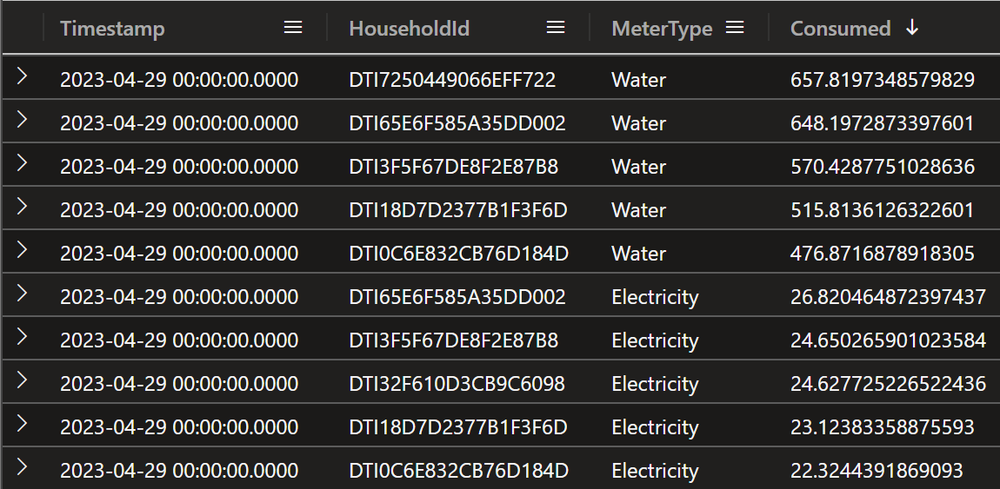

We have the columns Timestamp:datetime , HouseholdId:string, MeterType:string, and Consumed:double.

Let's see if we can find some more information about the data.

```kusto
Consumption
| summarize count() by MeterType
```

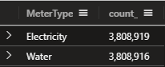

So we have two different MeterTypes, Water and Electricity. Let's see what we have in the 'Costs' table.

```kusto
Costs
```

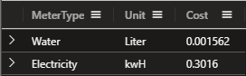

Ok, so we have the columns MeterType:string, Unit:string, and Cost:double.

The riddle stated that the costs have doubled, so let's see if we can find some more information about that.

```kusto
Consumption
| summarize Count=count() by Timestamp, HouseholdId, MeterType, Consumed
| where Count > 1
| sort by HouseholdId
```

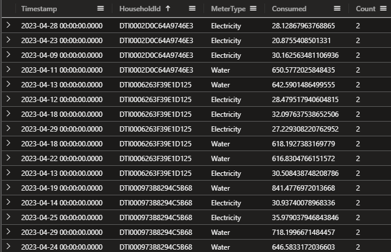

So we have some duplicate readings, let's see some data in a linechart per day.

```kusto
Consumption
| summarize sum(Consumed) by bin(Timestamp, 1d)
| render linechart 
```

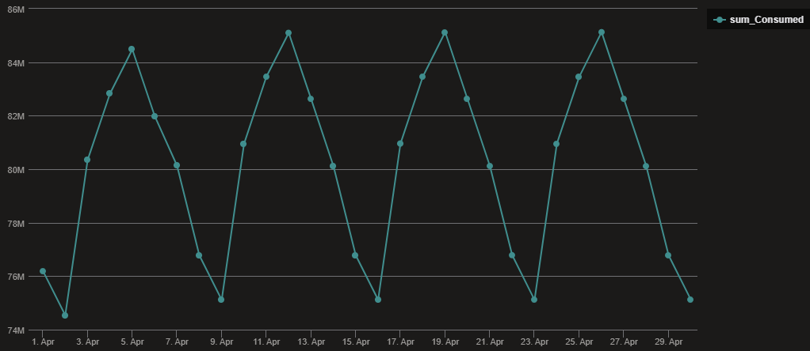

Grabbing one of the HouseholdId and take a look at the duplicate readings.

```kusto
Consumption
| where HouseholdId == "DTI0002D0C64A9746E3"
| sort by Timestamp asc
```

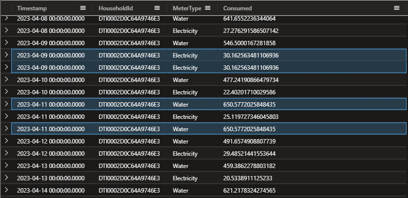

So we do have some duplicate readings, but we also have some readings that are not duplicate. We need to find a way to only calculate one reading per day and per MeterType. Let's try with some basic query.

```kusto
Consumption 
| summarize Readings = count() by HouseholdId, MeterType
| where Readings > 30
| sort by HouseholdId
```

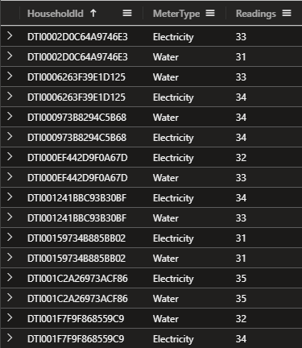

Ok, so we have some HouseholdId that have more than 30 readings per 'MeterType', we only want one reading per day per 'MeterType'.

I think we need to check the Consumed column and see if we have some negative values.

```kusto
Consumption
| where Consumed < 0
```

Yes, we have 144 records with that! So we need to have that in mind for our final solution.

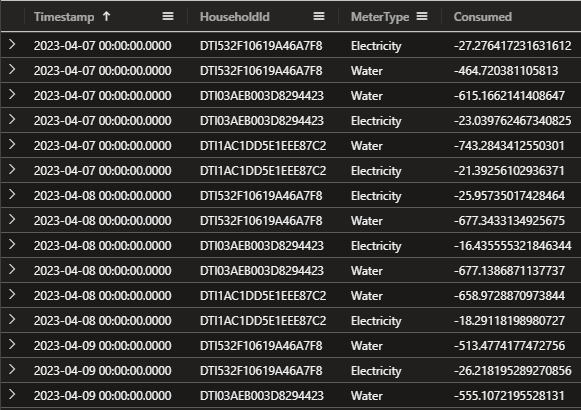

We have some options to remove duplicate readings, we can use the arg_max() function or distinct operator. Here we will only look at the Electricity MeterType.

**arg_max()**

```kusto
Consumption
| where Consumed > 0
| where MeterType == 'Electricity'
| summarize arg_max(Timestamp,*) by Consumed
| summarize sum(Consumed)
```

**distinct**

```kusto
Consumption
| where MeterType == 'Electricity'
| where Consumed > 0
| distinct *
| summarize sum(Consumed)
```

Same result, but I will use the arg_max() function in my solution. You remember that we had another table called 'Costs' with the cost for each MeterType? Let's join that table with the Consumption table with 'lookup' operator.

```kusto
Consumption
| where Consumed > 0
| summarize arg_max(Timestamp,*) by Consumed
| summarize sum(Consumed) by MeterType
| lookup Costs on MeterType
```

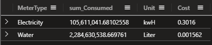

Now let's add the calculation for the total cost. Remember the names of the columns in the Costs table? We can use the same name for the columns in the Consumption table when we have the lookup operator. (We will make the name of the summarize more precise in the final solution, for now it will get the name of 'sum_Consumed'.)

```kusto
Consumption
| where Consumed > 0
| summarize arg_max(Timestamp,*) by Consumed
| summarize sum(Consumed) by MeterType
| lookup Costs on MeterType
| extend TotalCostPerMeterType = sum_Consumed * Cost
```

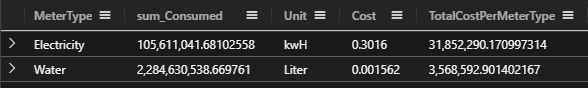

Grab your calculator and calculate the sum of the TotalCostPerMeterType column... just kidding, we can use the summarize sum() function to get the final result.

```kusto
Consumption
| where Consumed > 0
| summarize arg_max(Timestamp,*) by Consumed
| summarize sum(Consumed) by MeterType
| lookup Costs on MeterType
| extend TotalCostPerMeterType = sum_Consumed * Cost
| summarize sum(TotalCostPerMeterType)
```

To make it more readable we can rename our columns, see below:

```kusto
Consumption
| where Consumed > 0
| summarize arg_max(Timestamp,*) by Consumed
| summarize SumOfConsumed = sum(Consumed) by MeterType
| lookup Costs on MeterType
| extend TotalCostPerMeterType = SumOfConsumed * Cost
| summarize TotalBillforApril = sum(TotalCostPerMeterType)
```

Ok for a final solution but we can do better. The query above will take some time to run (11 seconds), let's see if we can optimize it.

```kusto
Consumption
| where Consumed > 0
| distinct *
| summarize SumOfConsumed = sum(Consumed) by MeterType
| lookup Costs on MeterType
| extend TotalCostPerMeterType = SumOfConsumed * Cost
| summarize TotalBillforApril = sum(TotalCostPerMeterType)
```

We are down to 4.5 seconds and we have the same result. This can be better with the shuffle query operator if we want to. Let's try that.

```kusto
Consumption
| summarize hint.strategy=shuffle arg_max(Consumed, *) by HouseholdId, MeterType, Timestamp
| lookup Costs on MeterType
| summarize sum(Consumed * Cost)
```

Down to 2 seconds now. Great! Get more familiar with the shuffle query operator here: [shuffle query](https://learn.microsoft.com/azure/data-explorer/kusto/query/shufflequery?WT.mc_id=AZ-MVP-5004683).


## Case 2

**Catch the Phishermen**


> Hey Detective,

> We've got another case that needs your expertise! The people of our city are being targeted by phishermen, and they need your help to stop them in their tracks.

> The complaints are pouring in, and people are fed up with the sudden increase in phishing calls attempting to steal their identity details. We can't let these scammers get away with it, and we need your help to catch them!

> The police have asked for our assistance, and we've got a massive data set to work with. We've got listings of all the calls that have been made during the week, and we need to find the source of the phishing calls.

> It's not going to be easy, but we know you're up for the challenge! We need you to analyze the data and use your detective skills to find any patterns or clues that could lead us to the source of these calls.

> Once we have that information, the police can take action and put a stop to these scammers once and for all! Are you ready to take on this challenge, detective?

> We've got your back, and we know you can do this! Let's catch those phishermen!

Let's jump into the data! Copy and run the following to create the PhoneCalls table. Warning, it took me almost 1,5 minute to ingest the data so be patient.

```kusto
.execute database script <|
.create-merge table PhoneCalls (Timestamp:datetime, EventType:string, CallConnectionId:string, Properties:dynamic)
.ingest async into table PhoneCalls (@'https://kustodetectiveagency.blob.core.windows.net/kda2c2phonecalls/log_00000.csv.gz')
.ingest async into table PhoneCalls (@'https://kustodetectiveagency.blob.core.windows.net/kda2c2phonecalls/log_00001.csv.gz')
// Last command is running sync, so when it finishes the data is already ingested.
// It can take about 1min to run.
.ingest into table PhoneCalls (@'https://kustodetectiveagency.blob.core.windows.net/kda2c2phonecalls/log_00002.csv.gz')
```

Let's see what we have.

```kusto
PhoneCalls
| take 10
```

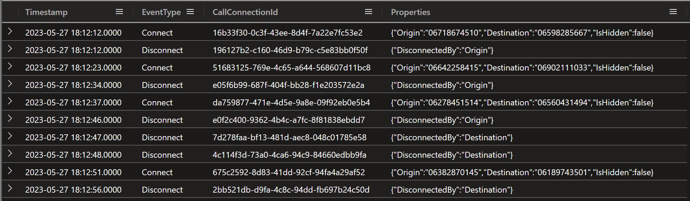

As you see we once again have the dynamic Properties column. We can with ease extract the values with dot notation - tostring(Properties.Origin).

Let's make the output easier to read and use 'project-reorder' to order the columns the way we want.

```kusto
PhoneCalls
| take 10
| extend Origin = tostring(Properties.Origin)
| extend Destination = tostring(Properties.Destination)
| extend IsHidden = tobool(Properties.IsHidden)
| extend DisconnectedBy = tostring(Properties.DisconnectedBy)
| project-reorder Timestamp,CallConnectionId,EventType,Origin,Destination,IsHidden,DisconnectedBy
```

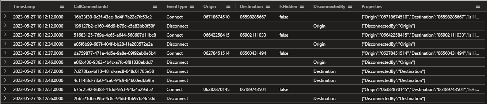

So we can assume that somewhere under the Origin column (that we created with the extend function) is our phishermen. And could the calls be under the 'IsHidden' property as well? 

I'm interested in when the phishermen starts working on the calls. Let's see if we can find some more information with summarize and the bin() function against the Timestamp column.

```kusto
PhoneCalls
| summarize count() by bin(Timestamp,1h)
```

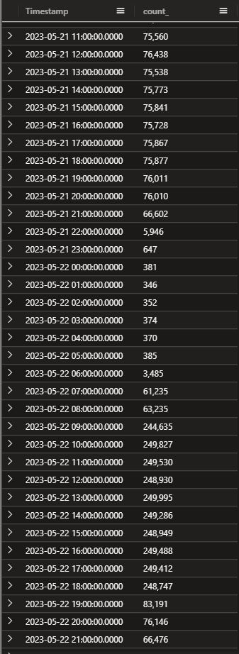

Hmm, at least I find that there are some significant increase but doesn't mean anything yet. Could be legit calls as well, it all depends on how many calls the phishermen have made.

But having this in mind, let's see if we can use that information to see if what will help us locating the phishermen.

Let's start by looking into the 'EventType' of 'Connect' and where the caller (Origin) hides their number with 'IsHidden'.

```kusto
PhoneCalls
| extend Origin = tostring(Properties.Origin)
| extend Destination = tostring(Properties.Destination)
| extend IsHidden = tobool(Properties.IsHidden)
| extend DisconnectedBy = tostring(Properties.DisconnectedBy)
| where EventType == "Connect"
| where IsHidden == true
| summarize count() by Origin
```

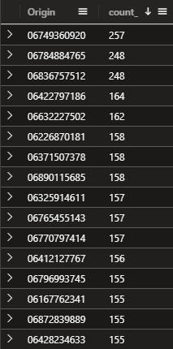

Here's our first suspects for this crime, because I do belive that the phishermen have been making a larger number of calls. Let's see if we can find some more information.

Let's add some calculation to the 'Connect' and 'Disconnect' events. We can use the datetime_diff() function to calculate the time between the events.

I have renamed the columns for the time to ConnectTime and DisconnectTime (Timestamp1 refers to the Timestamp inside of the join, and are therefore the DisconnectTime).

Where hourofday() function is great so we can only search for the time between 9 and 18.

Also added a new column called TimeDiffMinutes to see how long the calls are and I have added a filter to only show calls that are between 0 and 10 minutes long.

Let's focus on one days events, as you see in the query below I have added a filter for the 22nd of May 2023.

```kusto
PhoneCalls
| where Timestamp between (datetime(2023-05-22 00:00:00) .. datetime(2023-05-22 23:59:59))
| extend Origin = tostring(Properties.Origin)
| extend Destination = tostring(Properties.Destination)
| extend IsHidden = tobool(Properties.IsHidden)
| where EventType == "Connect"
| where IsHidden == true
| join kind=inner 
    (
        PhoneCalls
        | where EventType == "Disconnect"
        | extend DisconnectedBy = tostring(Properties.DisconnectedBy)
    ) 
        on CallConnectionId
| project ConnectTime=Timestamp,DisconnectTime=Timestamp1,CallConnectionId,Origin,Destination,DisconnectedBy,IsHidden
| extend TimeDiffMinutes = datetime_diff('minute',DisconnectTime,ConnectTime)
| where TimeDiffMinutes between (0 .. 10)
| where hourofday(ConnectTime) >= 9
| where hourofday(ConnectTime) < 18
| project-reorder TimeDiffMinutes,*
```

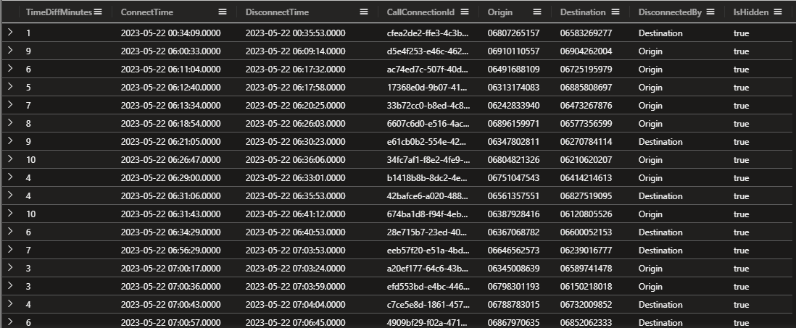

So we have a lot of calls that are between 0 and 10 minutes long. Let's see if we can find some more information about the calls if we add the dcount() function.

! Note that we need to remove the first where clause (where Timestamp between (datetime(2023-05-22 00:00:00) .. datetime(2023-05-22 23:59:59))) to get the correct result.

Added CountOfCalls with dcount(Destination) to see if we can identity who have been making the most calls (and of course we need to sort the output and grab top 10).

```kusto
PhoneCalls
| extend Origin = tostring(Properties.Origin)
| extend Destination = tostring(Properties.Destination)
| extend IsHidden = tobool(Properties.IsHidden)
| where EventType == "Connect"
| where IsHidden == true
| join kind=inner 
    (
        PhoneCalls
        | where EventType == "Disconnect"
        | extend DisconnectedBy = tostring(Properties.DisconnectedBy)
    ) 
        on CallConnectionId
| project ConnectTime=Timestamp,DisconnectTime=Timestamp1,CallConnectionId,Origin,Destination,DisconnectedBy,IsHidden
| extend TimeDiffMinutes = datetime_diff('minute',DisconnectTime,ConnectTime)
| where TimeDiffMinutes between (0 .. 10)
| where hourofday(ConnectTime) >= 9
| where hourofday(ConnectTime) < 18
| project-reorder TimeDiffMinutes,*
| summarize CountOfCalls = dcount(Destination) by Origin
| sort by CountOfCalls desc 
| top 10 by CountOfCalls
```

Have we found our phishermen? 🎣

## Case 3

Coming soon...