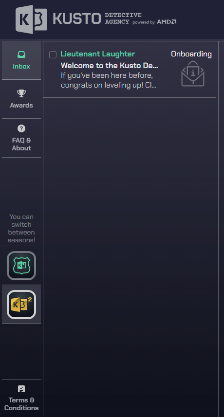

# Kusto Detective Agency Hints - Season 2

This repo contains some additional hints to the existing ones in the game of Kusto Detective Agency 🕵️ 🔐 (Under construction!)

In this season of Kusto Detective Agency (KDA) there will be 10 new challenges.

* [Onboarding Case](_Onboarding.md)
* [Case 1](Case_1.md)
* [Case 2](Case_2.md)
* [Case 3, Under progress...](Case_3.md)
* [Case 4, Under progress...](Case_4.md)
* [Case 5, Under progress...](Case_5.md)
* [Case 6](Case_6.md)
* [Case 7 (Coming Soon)]()
* [Case 8 (Coming Soon)]()
* [Case 9 (Coming Soon)]()
* [Case 10 (Coming Soon)]()

## Information

We can switch between the seasons if we want to. See the green icon for season 1 and the yellow icon for season 2.

Like season 1 we will have a onboarding process and guess what, we all are rookies once again.

> If you have been here for Season 1, you may be surprised to find yourself as a Rookie again. You see, it's all about innovation and hitting refresh. So, it's a fresh start for everyone. Yet we believe in excellence and that's why we need your detective skills to unveil the crème de la crème of detectives from the past year, 2022. This is like the ultimate leaderboard challenge where we crown the "Most Epic Detective of the Year." Exciting, right?

> Imagine our agency as a buzzing beehive, like StackOverflow on steroids. We have a crazy number of cases popping up every day, each with a juicy bounty attached (yes, cold, hard cash!). And guess what? We've got thousands of Kusto Detectives scattered across the globe, all itching to pick a case and earn their detective stripes. But here's the catch: only the first detective to crack the case gets the bounty and major street cred!

> So, your mission, should you choose to accept it, is to dig into the vast archives of our system operation logs from the legendary year 2022. You're on a quest to unearth the absolute legend, the detective with the biggest impact on our business—the one who raked in the most moolah by claiming bounties like a boss!

> Feeling a bit rusty or want to level up your Kusto skills? No worries, my friend. We've got your back with the "Train Me" section. It's like a power-up that'll help you sharpen your Kusto-fu to tackle each case head-on. Oh, and if you stumble upon a mind-boggling case and need a little nudge, the "Hints" are there to save the day!

> Now, strap on your detective hat, embrace the thrill, and get ready to rock this investigation. The fate of the "Most Epic Detective of the Year" rests in your hands!

> Good luck, rookie, and remember to bring your sense of humor along for this wild ride!

> Lieutenant Laughter

