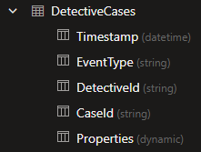
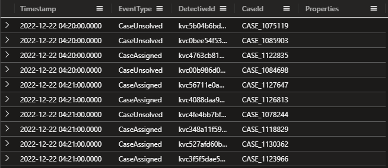
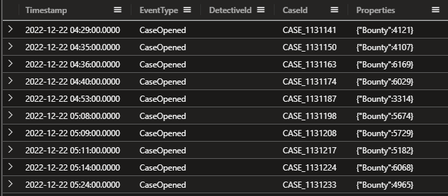
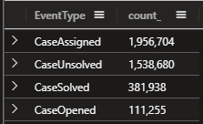
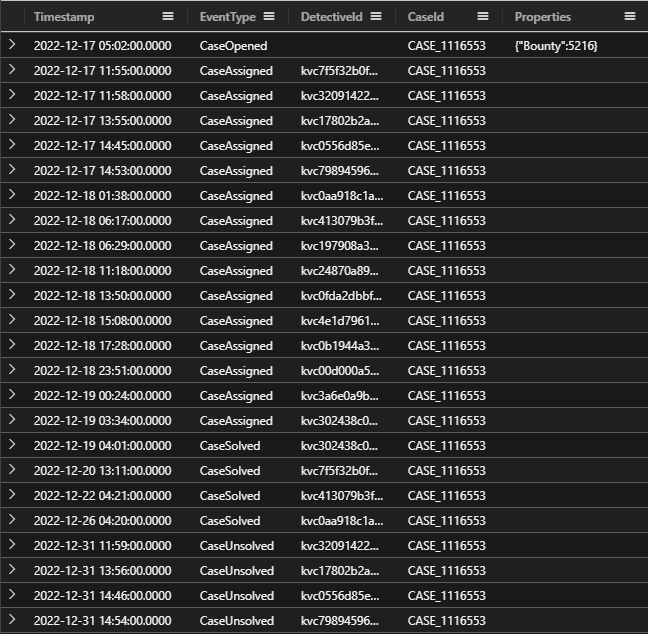

## Onboarding

**Welcome to season 2!**

Answer the question: Who is the detective that earned most money in 2022?

Start by logging in to your free ADX cluster, if you need to start over and create a new cluster - follow the guide here https://aka.ms/kustofree. Make sure to copy the Cluster URI (ending with kusto.windows.net) and save that somewhere or access https://dataexplorer.azure.com/freecluster to see it.

Insert the below data into your ADX cluter:

```kusto
.execute database script <|
// Create a table for the telemetry data:
.create table DetectiveCases(Timestamp:datetime, EventType:string, DetectiveId:string, CaseId: string, Properties:dynamic)
// Load the data:
.ingest async into table DetectiveCases (@'https://kustodetectiveagency.blob.core.windows.net/kda2start/log_00000.csv.gz')
.ingest async into table DetectiveCases (@'https://kustodetectiveagency.blob.core.windows.net/kda2start/log_00001.csv.gz')
.ingest into table DetectiveCases (@'https://kustodetectiveagency.blob.core.windows.net/kda2start/log_00002.csv.gz')
```

Now we have the table **DetectiveCases** with the columns Timestamp:datetime, EventType:string, DetectiveId:string, CaseId: string, and Properties:dynamic.



```kusto
DetectiveCases
| take 10
```



In my case I didn't see any data in the Properties column. Let's dig into that.

```kusto
DetectiveCases
| where isnotempty(Properties)
| take 10
```



Oh now we see 'Bounty' and a value. And all cases have the event 'CaseOpened'. Let's see how many EventTypes we have.

```kusto
DetectiveCases
| summarize count() by EventType
```



Let's try to extract the Bounty value from the Properties column with:

```kusto
DetectiveCases
| extend Bounty = toreal(Properties.Bounty)
| where isnotempty( Bounty )
| project Timestamp, EventType, DetectiveId, CaseId, Bounty
```

Now that we have extracted that value we can add a new line with summarize sum() to get the total bounty.

```kusto
DetectiveCases
| extend Bounty = toreal(Properties.Bounty)
| where isnotempty(Bounty)
| project Timestamp, EventType, DetectiveId, CaseId, Bounty
| summarize TotalBounty = sum(Bounty)
```

If we go deeper into a case and how that case will be assigned to different detectives, we do see that multiple detectives can solve one case.

```kusto
DetectiveCases
| where CaseId == "CASE_1116553"
```



I do believe we need to join this with "CaseSolved" event and take the first detected that solved that case and the arg_min() function with the Timestamp column will help us with that.

**My solution:**

```kusto
DetectiveCases
| extend Bounty = toreal(Properties.Bounty)
| project CaseId, DetectiveId, Bounty
| join kind=inner (
DetectiveCases
| where EventType == "CaseSolved"
| summarize arg_min(Timestamp, DetectiveId) by CaseId
| project-rename FirstDetective=DetectiveId
) on CaseId
| summarize TotalBountyToDetective=sum(Bounty) by FirstDetective
| top 1 by TotalBountyToDetective desc
```
